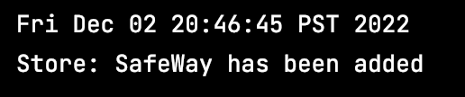
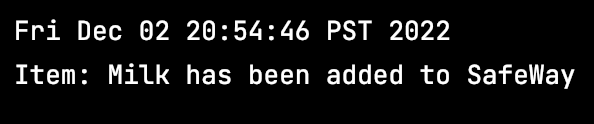
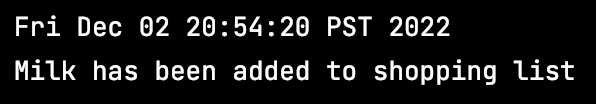
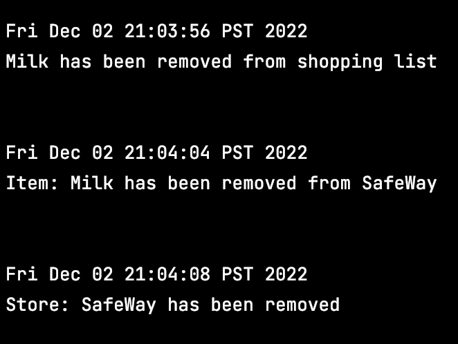

# 
 My Personal Project 

## 
 FindMyGroceries 
   
 (A shopping list and grocery store recommendation system)

The aim of this project is to design an application that implements a system to store a user's shopping list and recommend the ideal grocery stores that the user should go to buy the shopping items. The system also recommends the user for the ideal grocery stores they should go and hence save money.

The application is mainly designed for, but not limited to:
- **Customers who live in a close proximity to a lot of grocery stores with price differences on daily supplies.**
- **College/University students who are looking to save time and money on frequent grocery shopping**
- **Senior Citizens**

This project particularly appealed to me because I have seen my friends at university who often take loads of time to figure out which items to get from what grocery store. Hence, I wanted to design something convenient and useful that would allow them and many others to make informed decisions as a consumer and also help them budget on their monthly expenditure when it comes to grocery shopping.

## User Stories
- As a user, I want to be able I want to be able to create a new store and add it to a list of stores.
- As a user, I want to be able to remove a store from a list of stores.
- As a user, I want to be able to select a store and add items to that store.
- As a user, I want to be able to select a store and remove items from that store.
- As a user, I want to be able to select a store and view a list of the items in that store.
- As a user, I want to be able to add items to a shopping list.
- As a user, I want to be able to remove items from a shopping list.
- As a user, I want to be able to save the state of my application.
- As a user, I want to be able to load the state of my application. 
- As a user, I want to be able to process a shopping list to know the which store to go to for a particular item to get the cheapest product.

## Instructions for Grader
- You can generate the first and the second required event relating to creating a store and adding it to the list of stores by opening the store menu from the main menu and pressing the add store button. You can also remove a store by selecting it from the list and pressing the remove store button.
- You can generate the second and third required event relating to adding/removing items to a store by selecting a store in the store menu and pressing enter store button which displays store item menu for that store. Items can be added or removed from the table of that store using the add item or remove item button. Items can also be updated using the update item button.
- You can generate the fifth required event relating to viewing the items in the store by selecting a store and entering store to view items in the item menu on a table
- You can generate the sixth and seventh required event relating to adding/removing shopping list items to a shopping list by pressing the shopping list menu at the main menu which opens a new window and lets the user add shopping list items by the add item button or remove shopping list item by selecting an item and pressing the remove item button.
- You can locate my visual component of my application on the Main Menu screen, the Shopping List menu screen, Store Menu and Item Menu screen through pics of groceries, tables and label pics for each window.
- You can save the state of my application by pressing the save button at main menu.
- You can reload the state of my application by pressing the load button at main menu. 
- You can process the tenth required event relating to processing the shopping list by pressing the shopping list menu and then pressing process list button 

## Logging an event: example

When a Store is added to the Shopping List, an event is added to the event log that describes the addition of the
Store with its name, date and time added.   For example: when a Store named "SafeWay" is added to the
shopping list, the event description reads:

When an Item is added to a store, an event is added to the event log that describes the addition of the
item to that store with that item name, date and time and the store the item was added too.   For example: when a Item named "Milk" is added to the
store SafeWay, the event description reads:

When an Item is added to a shopping list, an event is added to the event log that describes the addition of the
item to the shpping list its name, date and time and the store the item was added too.   For example: when a Item named "Milk" is added to the
shopping list, the event description reads:

The removal of a Store, Shopping List item or a Store item is displayed in a similar way. For example: 

## UML Diagram and Suggestions 
